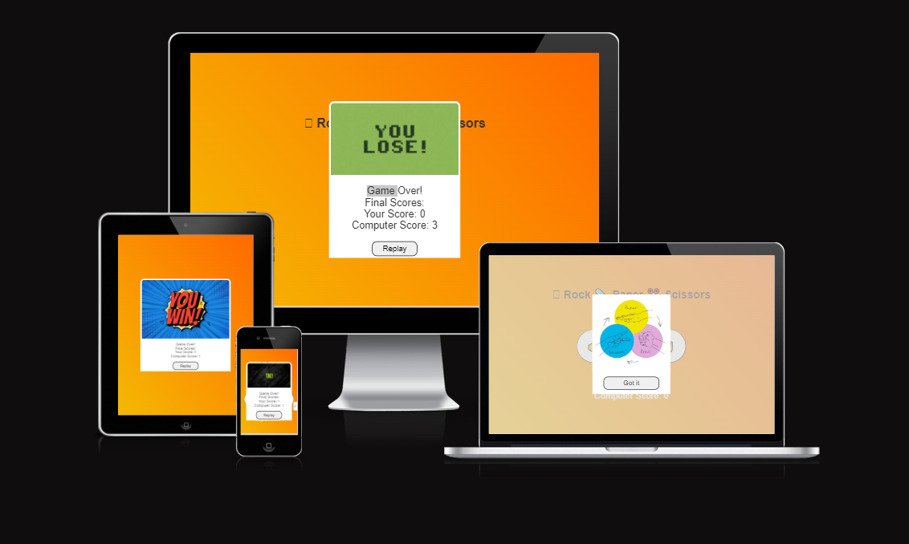
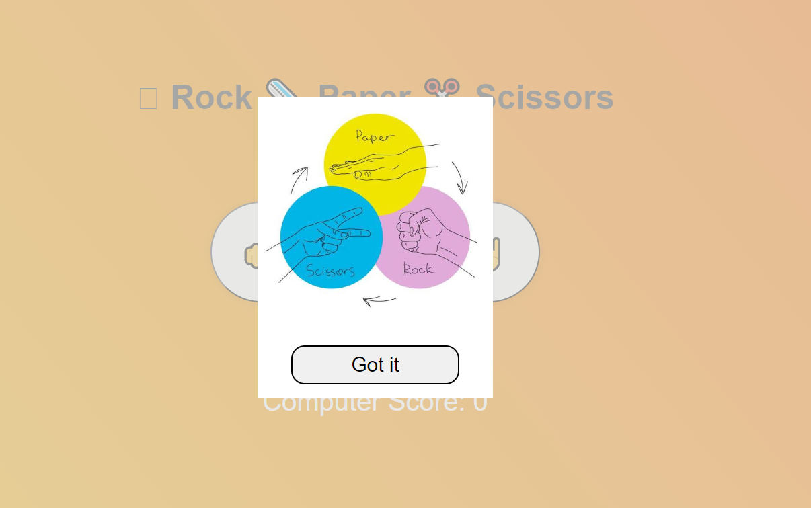
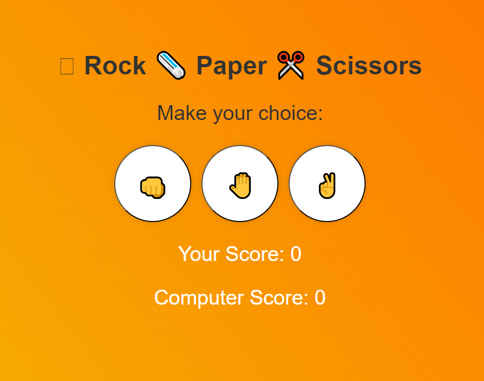
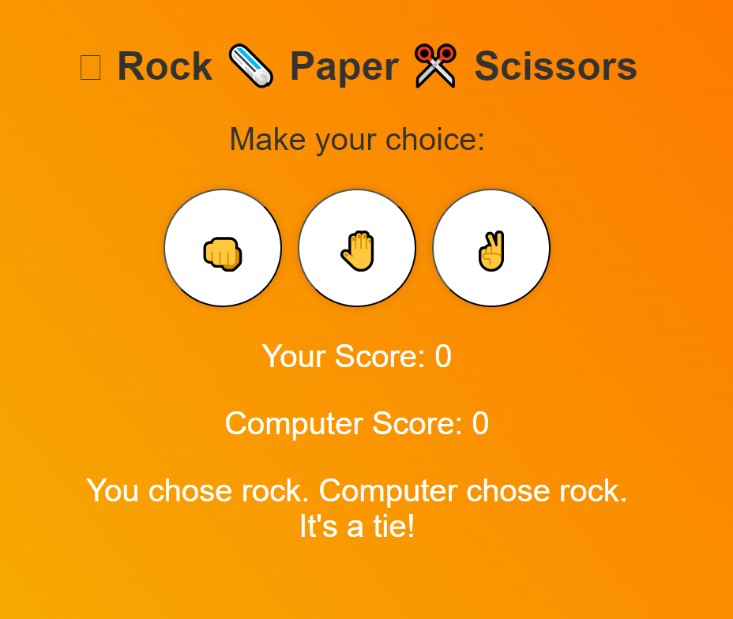
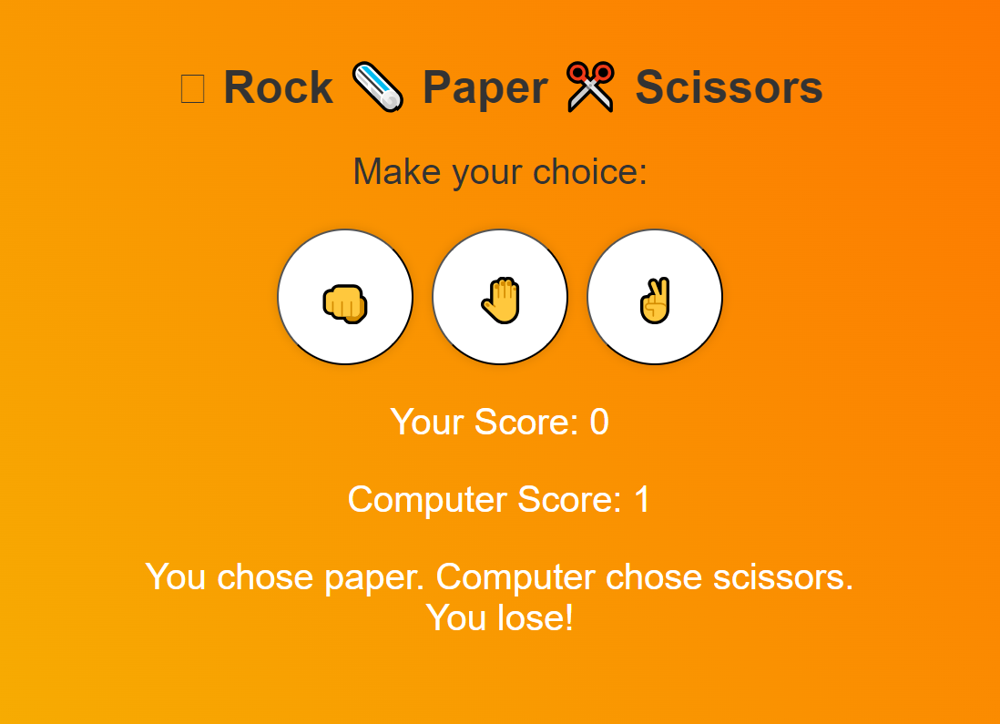
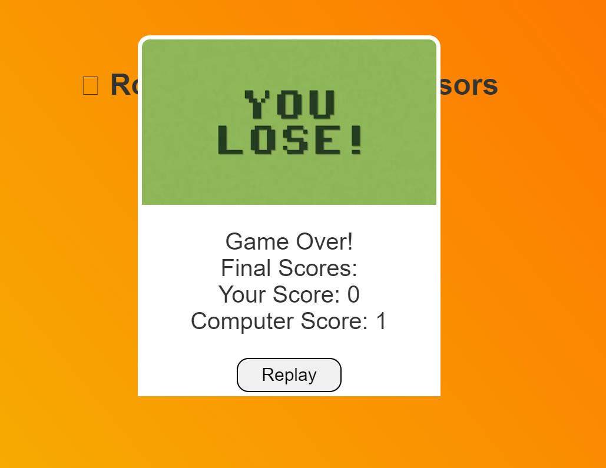
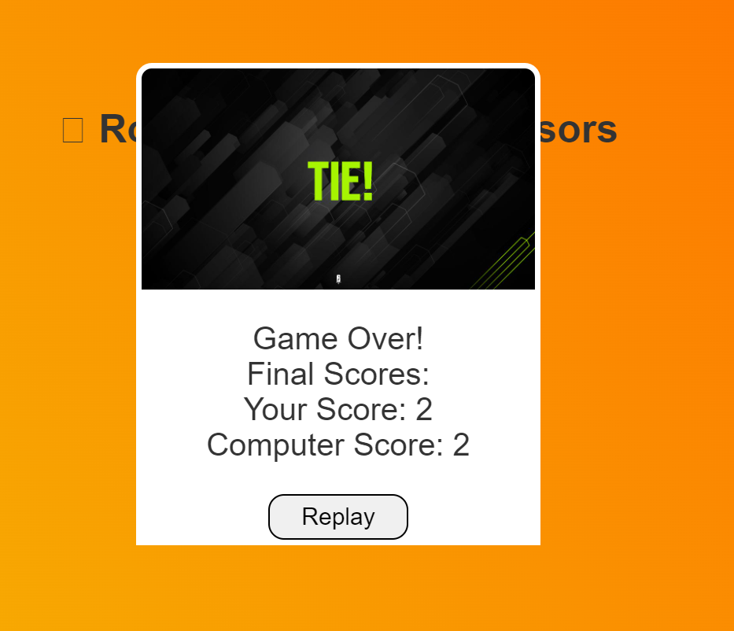
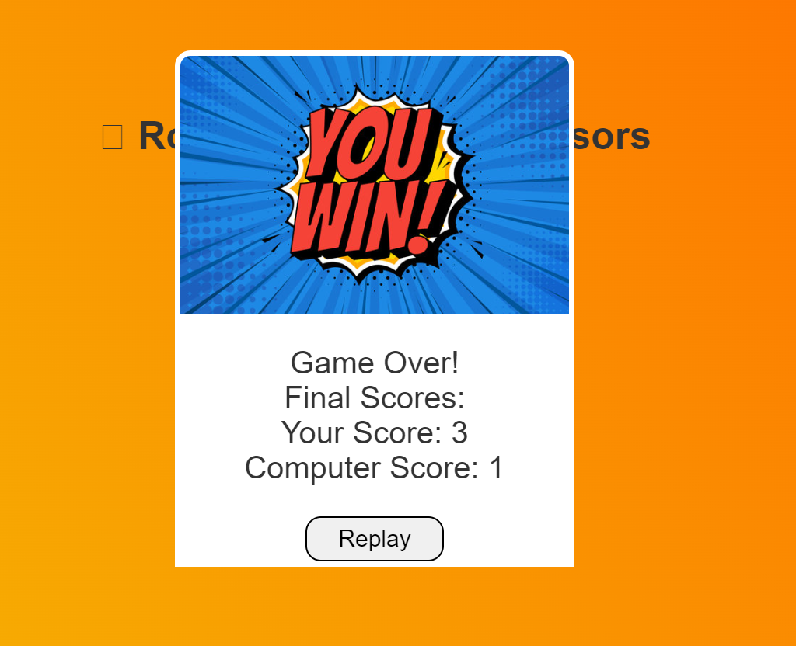

# Rock-Paper-Scissors Game
## Welcome to the Rock-Paper-Scissors project! This README provides an overview of the project, including user experience design, features, technologies used, testing, deployment, and credits.
#### Visit the deployed website: https://jb060.github.io/rock-paper-scissors/

## Table of Contents
1. [User Experience (UX)](#user-experience-UX)
    1. [Project Goals](#project-goals)
2. [Features](#features)
    1. [General](#general)
    2. [Home Section](#home-section)
    3. [Instructions Section](#instructions-section)
    4. [Game section](#game-section)
    5. [Result Section](#result-section)
3. [Technologies Used](#technologies-used)
    1. [Languages Used](#languages-used)
    2. [Frameworks, Libraries and Programs Used](#frameworks-libraries-and-programs-used)
4. [Testing](#testing)
    1. [Tools Testing](#tools-testing)
    2. [Manual Testing](#manual-testing)
5. [Finished Product](#finished-product)
6. [Improvements](#Improvements)
    1. [Game Modes](#Game Modes)
    2. [AI Enhancements](#AI Enhancements)
    3. [Statistics](#Statistics)
    4. [Gameplay Variations](#Gameplay Variations)
8. [Deployment](#deployment)
    1. [GitHub Pages](#github-pages)
9. [Credits](#credits)
    1. [Content](#content)
    2. [Media](#media)
    3. [Code](#code)
10. [Acknowledgements](#acknowledgements)

# User Experience (UX)
## Project Goals
The goal of this project is to create a simple, engaging, and responsive Rock-Paper-Scissors game that is easy to play and accessible on 
various devices. The project aims to deliver a visually appealing interface with clear instructions and immediate feedback on game results.

# Features
### General
- <strong>Responsive Design</strong>: Adaptable to different screen sizes and devices:
  

- <strong>Interactive Elements</strong>: Buttons and animations to enhance user engagement.

### Home Section
- <strong>Introduction</strong>: Brief overview of the game: 
- <strong> Start Button</strong>: A prominent button to start the game.   A prominent button to start the game.

### Instructions Section
- <strong>How to Play</strong>: Simple and clear instructions for playing Rock-Paper-Scissors.
- <strong>Rules Explanation </strong>: Detailed rules including how to win, lose, or draw.
   
### Game Section
- <strong>Choice Buttons</strong>: Options to select Rock, Paper, or Scissors.
  
- <strong>Visual Feedback</strong>: Displays both user and computer choices with corresponding icons.
- <strong>Game Logic</strong>: Determines the outcome (win, lose, or draw) based on the choices made.
  
  

### Result Section
- <strong>Outcome Display</strong>: Shows whether the user has won, lost, or drawn.
<strong>lose screen shows you lost the game</strong>
<strong>lose screen shows you lost the game</strong>
<strong>lose screen shows you lost the game</strong>

- <strong>Score Tracker</strong>: Keeps track of the number of wins, losses, and draws.
  
# Technologies Used

### Languages Used
- <strong>HTML5</strong>: For structuring the web pages.
- <strong>CSS3</strong>: For styling and layout.
- <strong>JavaScript</strong>: For game logic and interactivity.

### Frameworks, Libraries, and Programs Used:
- <strong>Bootstrap<strong>: For responsive design and layout.
- <strong>FontAwesome</strong>: For icons used in the game.
- <strong>Google Fonts</strong>: For typography.
- <strong>jQuery</strong>: For simplifying JavaScript code.
- <strong>GitHub</strong>: For version control and project hosting.

# Testing
### Tools Testing
- <strong>Lighthouse: Check performance, accessibility, best practices, and SEO.
- <strong>W3C Validators</strong>: HTML and CSS validation for code quality.
  
# Manual Testing
- <strong>Cross-Browser Testing</strong>: Ensured compatibility across multiple browsers (Chrome, Firefox, Safari).
- <strong>Device Testing</strong>: Verified functionality on various devices (desktops, tablets, smartphones).
- <strong>Functional Testing</strong>: Checked that all buttons, game logic, and feedback mechanisms work as expected.
  
# Finished Product
- The finished Rock-Paper-Scissors game is fully functional and responsive, providing a seamless user experience with an intuitive interface and real-time feedback. Screenshots and live demo links are available in the project repository.

# Improvements 
- The game at the minute is functional, but lacks a theme, I would like to make the following improvements in the future to make the game a lot better for users:
  
# Game Features
## Game Modes:
 - Single Player: Play against the computer.
 - Multiplayer: Two players can play against each other on the same machine.
 - Online Multiplayer: Implement online multiplayer functionality.
      
 ### AI Enhancements:
 - Difficulty Levels: Implement different difficulty levels by varying the computer’s strategy.
 - Learning AI: Implement a learning algorithm where the computer improves its strategy based on past games.

### Statistics:
 - Score Tracking: Keep track of scores across multiple rounds.
 - Game History: Display the history of moves and outcomes.

### Gameplay Variations:
 - Extended Choices: Include additional choices like Rock-Paper-Scissors-Lizard-Spock.
 - Custom Rules: Allow users to create their own rules or variations.

# Deployment:
<strong>GitHub Pages</strong>
<strong>This website was developed using GitPod, which was then committed and pushed to GitHub using the GitPod terminal.
Here are the steps to deploy this website to GitHub Pages from its GitHub repository:</strong>

1. Log in to GitHub and locate the GitHub Repository.

2. At the top of the Repository, locate the Settings button on the menu.

3. Alternatively click here for a GIF demonstration of the process.
Please scroll down the Settings page until you find the Pages section.

4. Under Source, click the None dropdown and select Master Branch.

5. The page will refresh automatically and generate a link to your website.

# Credits
### Content
- <strong>Game Logic</strong>: Custom JavaScript code developed to implement game functionality.
- <strong>Text</strong>: Instructions and game descriptions written by Jason Byrne.
  
### Media
- <strong>Icon</strong>s: Sourced from FontAwesome.
- <strong>Graphics</strong>: Created Photoshop for visual elements in the game.

### Code
- <strong>Inspiration</strong>: Various online resources and tutorials inspired and guided the development process.
  
  <strong>Her lies the code for the function fir the score keeping of the game.

# Acknowledgements
- <strong>Mentor</strong>: Thanks to my mentor Marcel who has provided me with great insight into the world of javascript and his experience within the space.  
- <strong> Slack Community</strong>: Thanks to the online development communities and tutorial creators who provided valuable insights and guidance.
- <strong>Feedback</strong>: Appreciation to the users who provided feedback during testing and helped refine the game.

# Thank you for exploring the Rock-Paper-Scissors game! Enjoy playing!

